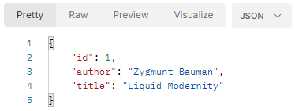

# Almeida Library - Web Application Project
This project aims to develop a web application that addresses microservices architecture, expanding knowledge and practical experience in the fields of the software development cycle, frameworks, programming, testing and deployment.

* [General info](#general-info)
* [Development](#c)
* [Project Status](#project-status)
* [Inspiration](#inspiration)

## General info
The project is an application that addresses the idea of microservices, which describes components of a system that are independent or "loosely coupled". Each component has a defined responsibility and the resources it needs to function.  For the development of the application's microservices, Spring framwork, MySQL for database management and the Postman tool for building HTTP requests are currently being used.

## Development

### Part 1: REST-based service

Through the Spring Starter Project in Eclipse, I configured this project with what is necessary for the development of this microservice-based application. The first implementation provided by Spring Boot itself was a class that is: “a configuration class that declares one or more @Bean methods and also triggers automatic configuration and component scanning.” This is the main class for running the application.

I created a class called BookServiceController that will be responsible for mapping HTTP requests to this service. The first annotation as metadata configuration is @RestController. This class-level annotation shows that the class is a controller (@Controller) which makes the class a component for the scan performed by @ComponentScan and will be registered as a bean in the container; and indicates that the return value of the methods must be linked to the web response body (@ResponseBody) and will be serialized in JSON format. Generally speaking, the Spring container will know that the class will perform a REST-based service. I added the annotation, @RequestMapping(value = "/api/almeidalibrary/"), which will precede any URI. 

I created a POJO class called Book. This class was imported into the BookServiceController controller which has the method: public Book getAllExistingBooks(). This method has method-level annotation, @RequestMapping(value="/{bookId}",method=RequestMethod.GET), which will perform the mapping of the URI variable with the method parameter; the method has a parameter associated with the URI variable, bookId, public Book getAllExistingBooks(@PathVariable("bookId") int bookId), which will be associated with the browser entry. In fact, when I entered the browser with the URI, http://localhost:8080/api/almeidalibrary/1, “api/almeidalibrary” is the root for all URIs on the “localhost” server; “1” was the input value that represents an “id”, and was associated with the method parameter and returned in the Book object. As the service is based on REST, JSON was the return format:

The public Book getAllExistingBooks(...) method returns a constructed (new) object of type Book with some information that is passed as arguments in the methods defined in the Book class and that are invoked by the Book object immediately after its creation. Only the “bookId” argument receives its value through the URI, where this value is associated with the parameter in the method.

## Project Status
The project is currently under development.

## Inspiration
This application is based on the book: Spring Microservices in Action.

