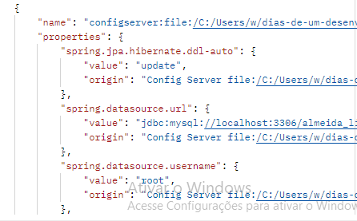
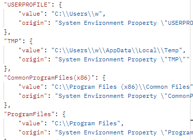

# Almeida Library - Web Application Project
This project aims to develop a web application that addresses microservices architecture, expanding knowledge and practical experience in the fields of the software development cycle, frameworks, programming, testing and deployment.

* [General info](#general-info)
* [Development](#c)
* [Project Status](#project-status)
* [Inspiration](#inspiration)

## General info
The project is an application that addresses the idea of microservices, which describes components of a system that are independent or "loosely coupled". Each component has a defined responsibility and the resources it needs to function.  For the development of the application's microservices, Spring framwork, MySQL for database management and the Postman tool for building HTTP requests are currently being used.

## Development

### Part 1: REST-based service

Through the Spring Starter Project in Eclipse, I configured this project with what is necessary for the development of this microservice-based application. The first implementation provided by Spring Boot itself was a class that is: “a configuration class that declares one or more @Bean methods and also triggers automatic configuration and component scanning.” This is the main class for running the application.

I created a class called _BookServiceController_ that will be responsible for mapping HTTP requests to this service. The first annotation as metadata configuration is @RestController. This class-level annotation shows that the class is a controller (@Controller) which makes the class a component for the scan performed by @ComponentScan and will be registered as a bean in the container; and indicates that the return value of the methods must be linked to the web response body (@ResponseBody) and will be serialized in JSON format. Generally speaking, the Spring container will know that the class will perform a REST-based service. I added the annotation, @RequestMapping(value = "/api/almeidalibrary/"), which will precede any URI. 

I created a POJO class called Book. This class was imported into the BookServiceController controller which has the method: public Book getAllExistingBooks(). This method has method-level annotation, @RequestMapping(value="/{bookId}",method=RequestMethod.GET), which will perform the mapping of the URI variable with the method parameter; the method has a parameter associated with the URI variable, bookId, public Book getAllExistingBooks(@PathVariable("bookId") int bookId), which will be associated with the browser entry. In fact, when I entered the browser with the URI, http://localhost:8080/api/almeidalibrary/1, “api/almeidalibrary” is the root for all URIs on the “localhost” server; “1” was the input value that represents an “id”, and was associated with the method parameter and returned in the Book object. As the service is based on REST, JSON was the return format:

The public Book getAllExistingBooks(...) method returns a constructed (new) object of type Book with some information that is passed as arguments in the methods defined in the Book class and that are invoked by the Book object immediately after its creation. Only the “bookId” argument receives its value through the URI, where this value is associated with the parameter in the method.

### Part 2: Building a configuration server for a microservice

When we talk about properties of an object, what do we mean? It means that the object has attributes, qualities or characteristics that distinguish it from others; the possession of these characteristics constitutes the properties of an object; it is something about the object “in itself” that is perceptible; for example, one of the properties of stone would be hardness. Through properties it is possible to describe the object or the concept of the object. Given these preliminary considerations, what would be the concept of cloud or cloud computing?

I would say that computational operations are carried out in “floating” locations without necessarily knowing where the operation in question came from; these operations can be thought of as services offered. One of the properties of cloud computing is having resources located in different locations and which can be accessed as services. Now, going directly to the ideas in the books, these services are offered as IaaS, PaaS and SaaS:

- IaaS refers to computing resources that are required for infrastructure as a service;
- PaaS indicates a platform as a service. The provider of this service offers resources in addition to infrastructure for application development; 
- SaaS is the idea of business applications or software products as a service.

A Spring Cloud configuration server was developed based on IaaS. Through the Spring Starter Project, a project based on Spring Boot was created with all the necessary configurations represented in the pom.xml file; this file represents a Maven project. These settings are necessary to initialize the server.The class that will start the Spring Cloud service is the class that has the main method that serves as the execution entry point. This class is the _ConfserverApplication_ class that returns at runtime an object of the Class class that represents ConfserverApplication. This class has two annotations: @SpringBootApplication and @EnableConfigServer. The @SpringBootApplication annotation includes @Configuration, @EnableAutoConfiguration, and @ComponentScan:

- @Configuration: Indicates that a class declares one or more @Bean methods and can be processed by the Spring container to generate bean definitions and service requests for those beans at run time. The Spring container will process a class with this annotation as a configuration class that will be used to define beans;
- @EnableAutoConfiguration: Indicates a self-configuration of the context that this annotation provides. This self-configuration also involves the beans that will be configured.
- @ComponentScan: A component can be a class with a certain annotation that will allow Spring to detect and register it as a bean in the application context.
- @EnableConfigServer allows a class to act as a configuration server for other applications. So, I have the ConfserverApplication class that will be used as a configuration server for the microservices.

The developed microservice is also a Spring Boot application called _bookmicroservice_. When this application is running, it must get its external configuration from the ConfserverApplication server that is listening for requests. The data is provided by the configuration server for the services. The configuration server manages the properties of each application. The application.properties file points to the repository that holds the application's configuration data. Regarding the configuration server, the configuration file contains:
- server.port: indicates the port on which the server should listen for requests;
- spring.profiles.active: indicates which profile is active. In my case, it is native, which means that I am using the filesystem to store application configuration data that will be loaded;
- spring.cloud.config.server.native.search-locations: represents the locations where Spring Boot should look for configuration files.

Spring Boot provides the Spring Boot Actuator. Thus, two properties were added that allow checking and managing the environment through endpoints such as /env, /health, for example. With the URI: http://localhost:8080/actuator/env, it is returned, 

 

Thus, I obtain configuration information from the application database as well as some environment information, respectively.

  
## Project Status
The project is currently under development.

## Inspiration
This application is based on the book: Spring Microservices in Action, and Spring Framework Documentation.

