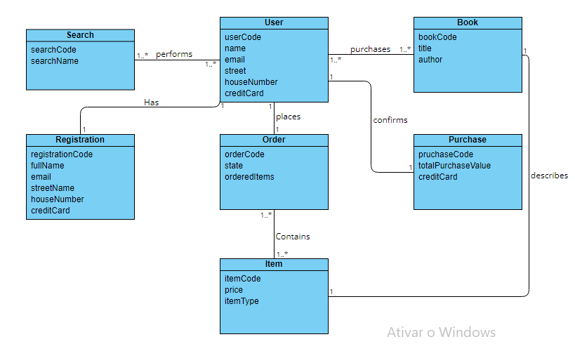
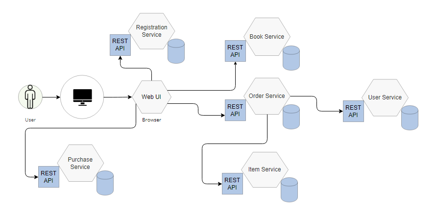
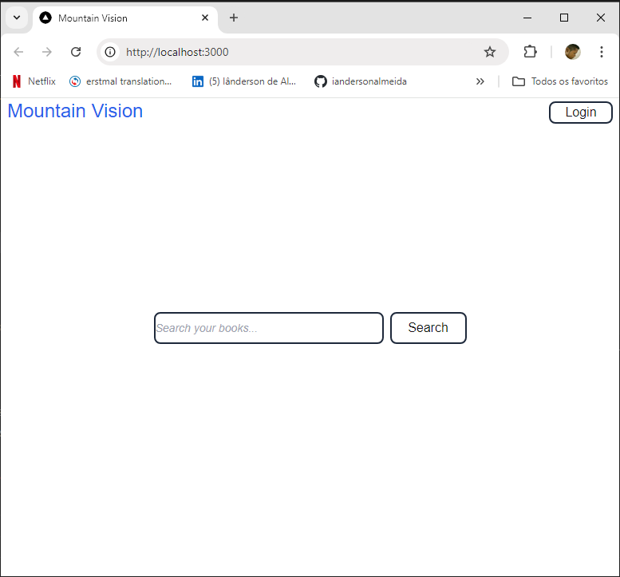
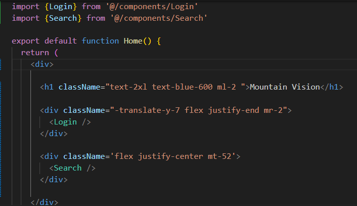

# Book Purchasing System - Web Application Project
This project aims to develop a web application that addresses microservices architecture, expanding knowledge and practical experience in the fields of the software development cycle, frameworks, programming, testing and deployment.

* [General info](#general-info)
* [Development](#c)
   - [Application domain model](#application-domain-model)
   - [Microservice architecture-based version of the application](#microservice-architecture-based-version-of-the-application)
   - [Returning data from the book service](#returning-data-from-the-book-service)
   - [ Homepage developed with Next.js](#homepage-developed-with-Next.js)
* [Project Status](#project-status)
* [Inspiration](#inspiration)

## General info
The project is an application that addresses the idea of microservices, which describes components of a system that are independent or "loosely coupled". Each component has a defined responsibility and the resources it needs to function. For the development of the application's microservices, Spring Boot, MySQL for database management, the Postman tool for building HTTP requests and React/Next for the user interface are currently being used.

## Development

### Application domain model

---------------------------

### Microservice architecture-based version of the application

--------------------------------------------------------------

### Returning data from the book service

Here is an example of communication between a MySQL database and a Spring Boot application that represents a service in the microservices architecture, in this case, a book service. I am using Spring Data JPA to access the database as well as the MVC architecture concept. Since this is a REST-based application, the service returns data in JSON format.
-------------------------------------------------------------------------------------------------------------------------------------------------------------------------------------------

### Homepage developed with Next.js
  

This homepage was developed using the Next.js framework. Next.js is defined as a React framework. Thus, from the React point of view, a component was created, rendered and displayed on the screen. 

 
This component represents the application's homepage and is a Javascript function that contains other components. Tailwind CSS was also used to add style to the page.
-----------------------------------------------------------------------------------------------------------------------------------------------------------------------------------------

  
## Project Status
The project is currently under development.

## Inspiration
This application is based on the book: Spring Microservices in Action, and Spring Framework Documentation.

